# Hi there, I'm Vlad Frangu! 👋 

I'm a backend-focused software engineer and open-source maintainer based in Romania. I spend most of my time building APIs, developer tooling, and libraries with [`TypeScript`] and [`Node.js`], occasionally reaching for [`React`] or [`Vue`] when a project needs a UI.

- 🛠️ I enjoy solving infrastructure, tooling, and API design problems
- 🌱 I'm currently exploring [`Rust`] while keeping an eye on the wider systems ecosystem
- ⚡ I learn best by diving into a problem, building something, and researching the sharp edges along the way
- 😄 Any pronouns are fine, as long as they're used respectfully

## 📚 Experience

I started programming in **2016** with [`Java`], moved to JavaScript in **2017**, and shortly after made [`TypeScript`] my daily language. Since then, I've worked across backend systems, web applications, developer experience, and open-source maintenance.

Today, my work is mostly centered around the Node.js ecosystem: designing reliable APIs, maintaining widely used packages, improving developer workflows, and reviewing the details that keep projects healthy over time.

### Key notes ✍️

- Self-taught software engineer, building software since **2016**
- Backend-focused, with full-stack experience when a project calls for it
- Most at home with **TypeScript**, **Node.js**, APIs, and developer tooling
- Active open-source contributor and maintainer
- Always happy to learn, collaborate, and talk shop

## 📫 How to reach me

-  [me@vladfrangu.dev](mailto:me@vladfrangu.dev)
-  [`@vladdy`](https://discord.gg/2p4j75jM9W)
-  [`WolfgalVlad`][Telegram]

## 🔭 Projects

A few projects and communities I spend time on:

- 👯 [`discord.js`] — a powerful TypeScript library for interacting with the Discord API
- 🧩 [`Discord API Types`] — versioned, up-to-date typings for the Discord API
- 💎 [`Sapphire`] — a collection of libraries and a framework for building Discord applications
- 🏳️‍🌈 [`pfp.lgbt`] — a simple tool for adding pride flags to images and GIFs
- 🤖 Community bots — custom Discord bots and tooling for communities including NASCAR and VALORANT LFG
- ⚡ [`async_event_emitter`] — a portable event emitter with first-class async support
- ✏️ [`highlight`] — a Discord bot that notifies you when chosen words or expressions are mentioned

> This is only a snapshot. You can find more in [`my repositories`].

### 👀 Quick statistics

<table>
  <tr>
    <td align="center" style="padding: 0; width: 50%;">
      
    </td>
    <td align="center" style="padding: 0; width: 50%;">
      
    </td>
  </tr>
</table>

> Provided by [`GitHub Readme Stats`].

<!----------------- LINKS ----------------->

[`TypeScript`]: https://www.typescriptlang.org/
[`Node.js`]: https://nodejs.org/
[`Java`]: https://www.java.com/
[`Rust`]: https://www.rust-lang.org/
[`Vue`]: https://vuejs.org/
[`React`]: https://react.dev/
[`my repositories`]: https://github.com/vladfrangu?tab=repositories
[`GitHub Readme Stats`]: https://github.com/stats-organization/github-stats-extended
[Telegram]: https://t.me/WolfgalVlad

<!--------------- PROJECTS ---------------->

[`discord.js`]: https://github.com/discordjs/discord.js
[`Discord API Types`]: https://github.com/discordjs/discord-api-types
[`Sapphire`]: https://github.com/sapphiredev/framework
[`pfp.lgbt`]: https://pfp.lgbt/
[`async_event_emitter`]: https://github.com/vladfrangu/async_event_emitter
[`highlight`]: https://github.com/vladfrangu/highlight
